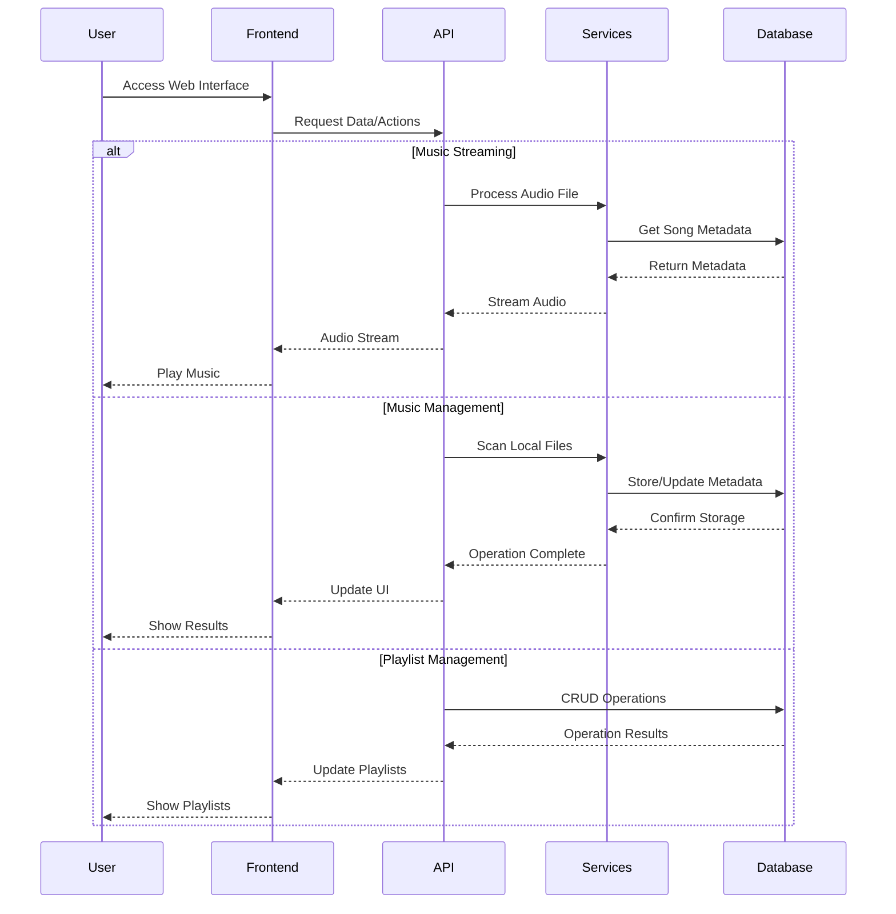

```mermaid
sequenceDiagram
    participant User
    participant Frontend
    participant API
    participant Services
    participant Database

    User->>Frontend: Access Web Interface
    Frontend->>API: Request Data/Actions

    alt Music Streaming
        API->>Services: Process Audio File
        Services->>Database: Get Song Metadata
        Database-->>Services: Return Metadata
        Services-->>API: Stream Audio
        API-->>Frontend: Audio Stream
        Frontend-->>User: Play Music
    else Music Management
        API->>Services: Scan Local Files
        Services->>Database: Store/Update Metadata
        Database-->>Services: Confirm Storage
        Services-->>API: Operation Complete
        API-->>Frontend: Update UI
        Frontend-->>User: Show Results
    else Playlist Management
        API->>Database: CRUD Operations
        Database-->>API: Operation Results
        API-->>Frontend: Update Playlists
        Frontend-->>User: Show Playlists
    end
```