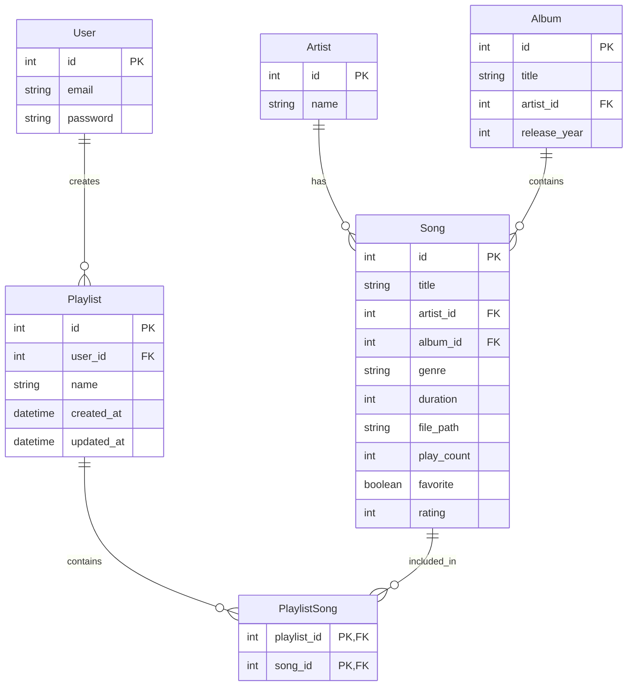

```mermaid
erDiagram
    User ||--o{ Playlist : creates
    User {
        int id PK
        string email
        string password
    }

    Playlist ||--o{ PlaylistSong : contains
    Playlist {
        int id PK
        int user_id FK
        string name
        datetime created_at
        datetime updated_at
    }

    PlaylistSong {
        int playlist_id PK,FK
        int song_id PK,FK
    }

    Song ||--o{ PlaylistSong : included_in
    Song {
        int id PK
        string title
        int artist_id FK
        int album_id FK
        string genre
        int duration
        string file_path
        int play_count
        boolean favorite
        int rating
    }

    Artist ||--o{ Song : has
    Artist {
        int id PK
        string name
    }

    Album ||--o{ Song : contains
    Album {
        int id PK
        string title
        int artist_id FK
        int release_year
    }
```