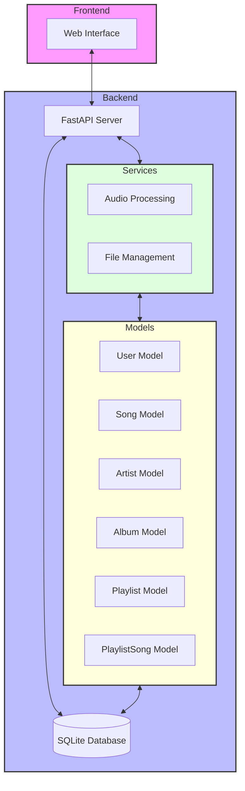

```mermaid
graph TB
    subgraph Frontend
        FE[Web Interface]
    end

    subgraph Backend
        API[FastAPI Server]
        DB[(SQLite Database)]

        subgraph Services
            AudioService[Audio Processing]
            FileService[File Management]
        end

        subgraph Models
            User[User Model]
            Song[Song Model]
            Artist[Artist Model]
            Album[Album Model]
            Playlist[Playlist Model]
            PlaylistSong[PlaylistSong Model]
        end
    end

    FE <--> API
    API <--> DB
    API <--> Services
    Services <--> Models
    Models <--> DB

    style Frontend fill:#f9f,stroke:#333,stroke-width:2px
    style Backend fill:#bbf,stroke:#333,stroke-width:2px
    style Services fill:#dfd,stroke:#333,stroke-width:2px
    style Models fill:#ffd,stroke:#333,stroke-width:2px
```